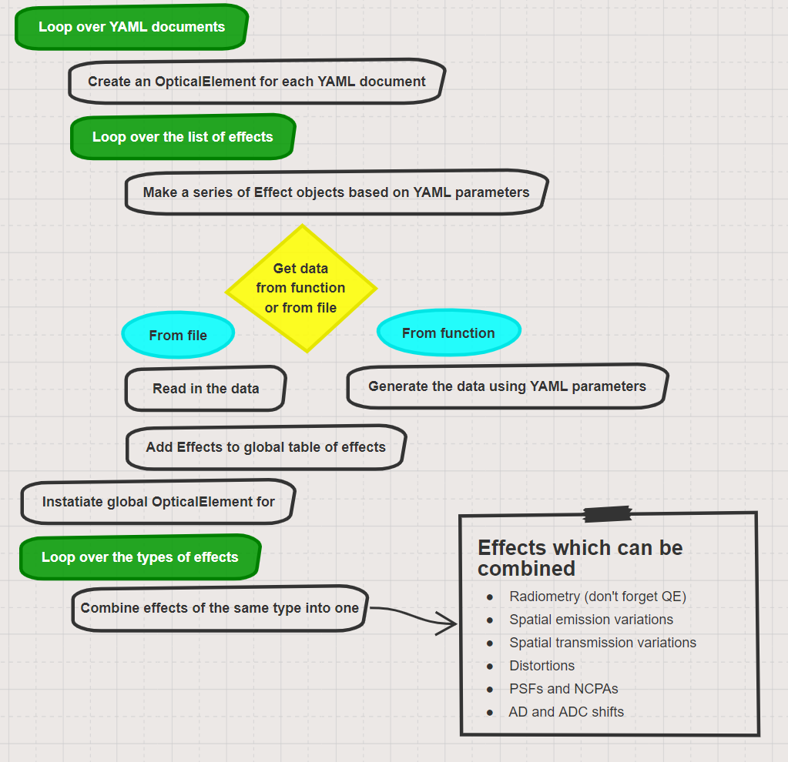
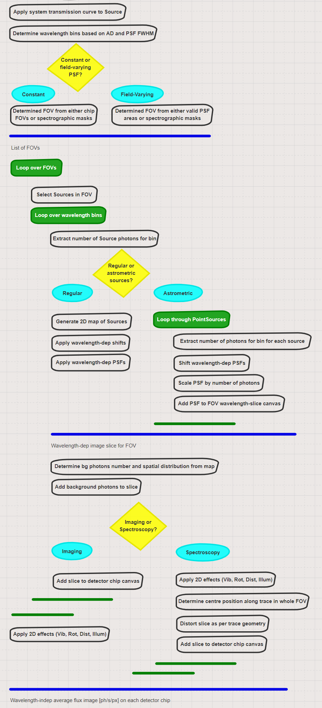

SimCADO 1.0 Code Design
=======================

Here are some ideas for designing the SimCADO 1.0 code.

.. figure::
    :width: 600

    A functionality workflow diagram for a SimCADO simulation

OpticalTrain class
------------------

observe() method
~~~~~~~~~~~~~~~~

    The workflow for the method ``observe``

make_optical_train method
~~~~~~~~~~~~~~~~~~~~~~~~~

    The workflow for the method ``make_optical_train``
