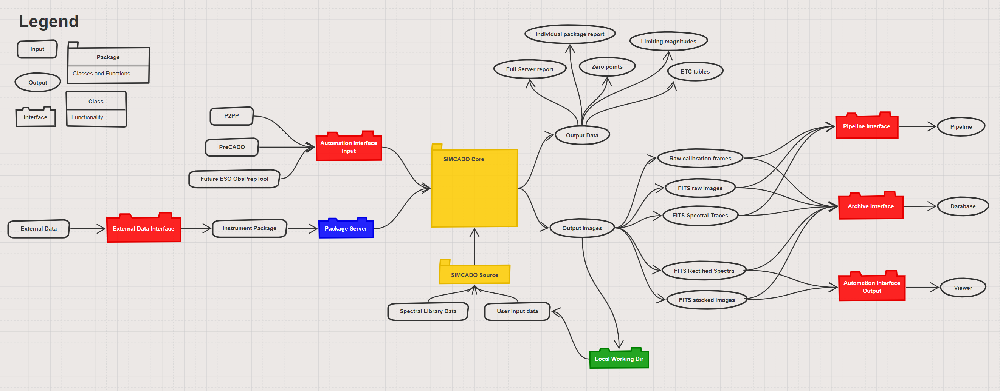
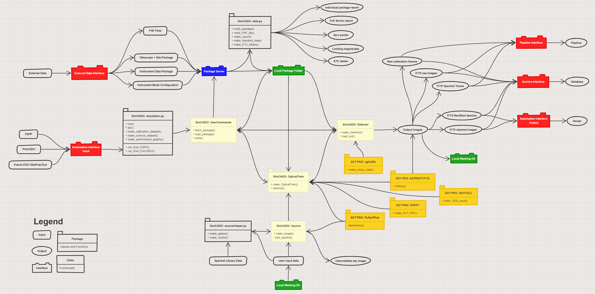

SimCADO 1.0 Interface Overview
==============================

    A slimmed down software design interface diagram for SimCADO 1.0

In the above diagram the main interfaces are shown in red. These can
be divided into input and output interfaces, and external and internal
interfaces. The distinction between external and internal is where parties
outside of the SimCADO team are involved. For example:

**External:**

#.  Data files for describing the effects of the optical train
#.  Parameters from external pieces of software which control and automated
    simulation run
#.  SimCADO Output which is to be sent to the other data flow teams:
    i.e. Pipeline and Archive
#.  Output which should be returned to an external source

**Internal:**

#. Local working directory

    The software design interface diagram for SimCADO 1.0