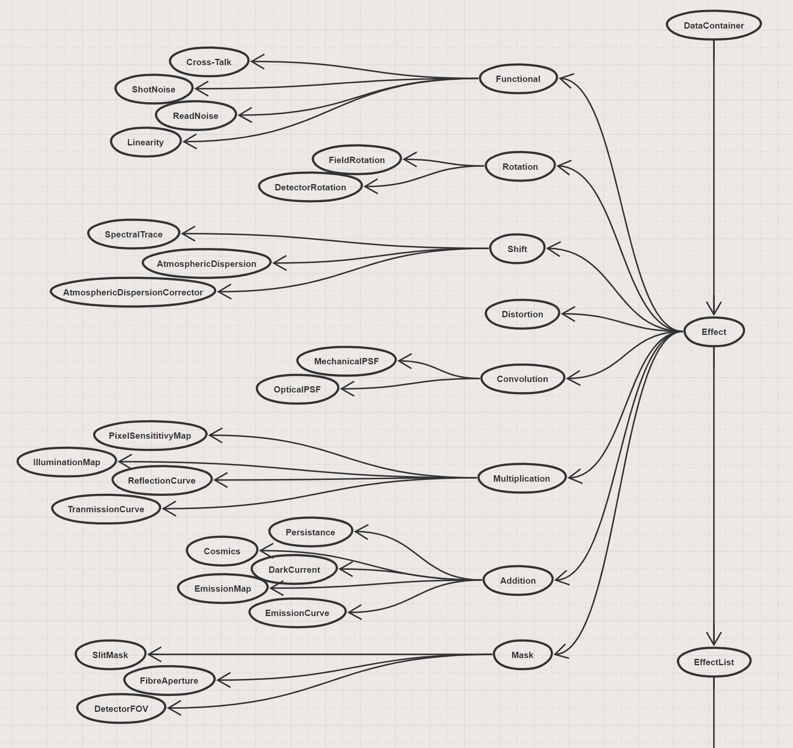

SimCADO 1.0 Effect Descriptions
===============================
Useful for the definition of data formats which describe the optical effects of
a certain instrument + telescope configuration

List of effect dimensions
-------------------------
Effects come in either 0, 1, 2, or 3 (2+1) dimensions

* 0D: Single values which aren't associated with a dimension. These are 
  generally values needed by a function, e.g. atmospheric temperature which is 
  needed to calculate the amount of atmospheric diffraction.

* 1D: Single dimensional vectors which act in the spectral range. These are 
  generally descriptions of effects which act in the spectral domain, and 
  therefore contain columns "Wavelength" and "Values", where "Values" can 
  include: "Transmissivity", "Emissivity", "Emission", "Reflectivity".
  Input files will primarily be **ASCII files**

* 2D: Two dimensional spatial effects. There are effects which are independent 
  of wavelength and act purely in the spatial domain. The format is generally a 
  2D image of the effect. The image need not cover the full field-of-view,
  e.g. the kernel of a PSF convolution, however the image may also cover the 
  full field of a detector, e.g. the hot/dead pixel map of a detector. 
  Input files will primarily be **FITS files**

* 3D: (2D+1D) Three dimensional spectrospatial effects. These are spatial 
  effects which have a wavelength dependence. E.g. the diffraction limited PSF 
  core increases with wavelength. Input files will primarily be **FITS files**

List of effect types
--------------------

    The list of possible optical effects which occur along an optical train

* Rotation: Requires the field of view to be rotated.

  * Field Rotation during observations,
  * Detector misalignment

* Shift: Requires the field of view to be shifted as a whole, either with or 
  without a wavelength dependence

  * Spectral traces,
  * Atmospheric dispersion (correction),
  * Sky offsets,
  * Nodding and chopping

* Distortion: A spatially dependent shift over the field of view

  * Telescope / Fore optic / Instrument distortion

* Convolution: An optical aberration that causes a convolution with a kernel 
  either over the field or a spectral range

  * 1D: Spatially constant, but spectrally varying

    * Line spread function

  * 2D: Spectrally and spatially constant (Mechanical PSFs)

    * Vibrations
    * Wind shake

  * 3D: Spectrally varying, but spatially constant (Optical PSFs)

    * GLAO,
    * Approximation of MCAO
    * NCPAs

  * 5D: Spatially and spectrally varying (Optical FV-PSFs)

    * SCAO,
    * real MCAO

* Multiplication:

  * 1D: Spectral operations

    * Transmission / reflection curves
    * Grating losses

  * 2D: Spatial operations

    * Pixel sensitivity maps
    * Illumination maps (Vignetting etc)

* Addition

  * 0D: Single values

    * Dark current

  * 1D: Spectral operations

    * Emission curves

  * 2D: Spatial operations

    * Emission maps (sky, mirror emission)
    * Persistence maps
    * Artifacts (cosmics, etc)

* Mask: Masks a certain region or range

  * 0D: Single values

    * Wavelength boundaries for simulation

  * 2D: Spatial masks

    * Detector field of view
    * Fibre / Slit field of view

Others

* Functional: Effects which are generated by functions

  * Shot noise
  * Read noise
  * Cross-talk
  * Linearity / Saturation

* Lists: Combinations of a similar type of effect, or description of a certain 
  type of element

  * List of Surfaces for radiometry
  * List of Detectors and their fields of view, rotations, read / dark noise 
    levels, pixels maps
  * List of slits and fibre positions in the field of view

    A visualisation of the different optical effects according to their type and
    active dimensions

Individual data file descriptions
---------------------------------

Summary of file specific meta data
~~~~~~~~~~~~~~~~~~~~~~~~~~~~~~~~~~

Meta data which tells Telescopy how to deal with the file are kept in the
values of the following keywords (prefaced with the letter E [for Effect])::

    ETYPE : The type of effect
    EDIM  : Dimensions on which the effect acts (0 Noise, 1 Spectral, 2 Spatial, 3 Spectrspatial)
    ECAT  : Extension with catalogue information (if FITS file)
    EDATA : Extension where the data begins (if FITS file)

Possible values for these keywords are:

======== ======== ======== ======== ======== ========
ETYPE    EDIM     ECAT     EDATA    Filetype Description
-------- -------- -------- -------- -------- --------

FVPSF    5        1        2        FITS     Wavelength dependent field varying PSFs
CONSTPSF 3        1        2        FITS     Wavelength dependent field constant PSFs
SLITTRAC 3        1        2        FITS     Slit spectral trace mappings on detector plane
FIBRTRAC 3        1        2        FITS     Fibre spectral trace mappings on detector plane
DISTMAP  4        -1       1        FITS     Wavelength in/dependent distortion maps
ILLUMMAP 2        -1       1        FITS     Illumination map - spatially varying transmission
EMISMAP  2        -1       1        FITS     Emission map - spatially varying emission
PIXELMAP 2        -1       1        FITS     Pixel sensitivity maps
PERSMAP  2        -1       1        FITS     Detector chip persistence maps
COSMICS  2        1        2        FITS     Images of Cosmic ray hits
APERLIST 2        NA       NA       ASCII    Spectroscopic aperture list
CHIPLIST 2        NA       NA       ASCII    List of positions of detector chips
SURFLIST 1        NA       NA       ASCII    List of surfaces and links to TER files
TERCURVE 1        NA       NA       ASCII    Wavelength dependent spectral response curves
EMSCURVE 1        NA       NA       ASCII    Wavelength dependent emission curve (Req: EUNIT)
LINEARIT 0        NA       NA       ASCII    Linearity curve for detector response
RONFRAME 0        1        2        FITS     Read noise frames (Req: CHIPTYPE)

======== ======== ======== ======== ======== ========

3D+ Effects
~~~~~~~~~~~

Field varying PSFs
++++++++++++++++++
**Description:** Contains PSFs for 1..N wavelengths that are applicable for a 
small part of the field. Each extension should contain a cube with each layer 
containing the PSF for a different region in the field of view. The applicable
on-sky region can either be described in EXT 1 in table format, or with a 
weights map that covers the field of view

**File type**: FITS

**File contents**:

* Ext 0 contains meta data,
* Ext 1 contains either a table or a weights map
* Ext 2..N contains the wavelength dependent PSF cubes

**Required header keywords**:

* EXT 0 Header (Empty)::

    AUTHOR
    DATE
    ORIGDATE
    SOURCE
    STATUS
    ETYPE : FVPSF
    EDIM  : 5
    ECAT  : 1      # In which extension is the catalogue data. -1 if no catalogue
    EDATA : 2      # In which extension does the real data start
    
* EXT 1 Header (BinTable)::

    NUMPSFS : 1..M   # How many PSF layers per cube.
    CATTYPE : table  # Catalogue format used to describe the valid FOV for a PSF
    CUNIT1           # Units for values in table (arcsec / arcmin / deg)

* EXT 1 Header (Image 2D/3D)::

    NUMPSFS : 1..M   # How many PSF layers per cube.
    CATTYPE : image
    Standard WCS for the image
    CTYPEn
    CUNITn
    CRVALn   # (0,0) meaning the centre of the field of view
    CRPIXn   # Pixel which corresponds to the centre of the field of view
    CDELTn

* EXT 2..N Header (Image 3D)::

    WAVE0
    WAVEUNIT    # Unit of wavelength. If absent assumption is [um]
    Standard WCS for the image
    CTYPEn
    CUNITn
    CRVALn   # (0,0) meaning the centre of the field of view
    CRPIXn   # Pixel which corresponds to the centre of the field of view
    CDELTn

**Required data format**

* EXT 1 (BinTable)

  (N,3) Table with the following columns
  
  ====== ====== =====
  x      y      layer
  float  float  int
  arcsec arcsec none
  ====== ====== =====
  
  where:

  * "x","y" are the centres of the valid regions. SimCADO draws its own map to 
    define where the borders are between these regions
  * "layer" is the position along the M dimension of the PSF cube

  .

* EXT 1 (Image 2D/3D)

  Image cube (x,y,N) with N>=1 layers
  
  Each layer is an image of the whole focal plane (can use much coarser 
  resolution than plate scale) where the pixel values correspond to the PSF layer 
  (from EXT >=2) that should be used in a given region. If there is a different 
  map for each wavelength then number of layers in the EXT 1 cube should equal to 
  the number PSF extensions, i.e. size(EXT 1) = (x,y,N) for a file with N 
  extensions. If there is only one layer in EXT 1, it will be assumed that this 
  weight map works for all wavelengths.

* EXT 2..N (Image 3D)

  N-2 Image cubes (x,y,M) each with M>=1 layers
  
  Each EXT holds a cube with PSFs for a certain wavelength. Each layer (x,y) in a 
  cube is a PSF kernel which is valid for a certain region of the focal plane and 
  for the wavelength given by WAVE0 in the header of each EXT. The location of 
  the valid region is given by the data in EXT 1. 

Spatially constant PSFs
+++++++++++++++++++++++
**Description**: Contains PSFs for 1..N wavelengths that are applicable over 
the whole field of view. The data structure will be the same as the field 
varying PSFs. 

**File type**: FITS

**File contents**:

* Ext 0 contains meta data,
* Ext 1 contains either a table or a weights map
* Ext 2..N contains the wavelength dependent PSF cubes

**Required header keywords**:

* EXT 0 Header (Empty)::

    AUTHOR
    DATE
    ORIGDATE
    SOURCE
    STATUS
    ETYPE : CONSTPSF
    EDIM : 3
    ECAT  : 1      # In which extension is the catalogue data. -1 if no catalogue
    EDATA : 2      # In which extension does the real data start
    
* EXT 1 Header (Empty)::

    NUMPSFS : 1
    CATTYPE : none  # The type of data used to describe the valid FOV for a PSF

* EXT 2..N Header (Image 2D)::

    WAVE0
    WAVEUNIT    # Unit of wavelength. If absent assumption is [um]
    Standard WCS for the image
    CTYPEn
    CUNITn
    CRVALn   # (0,0) meaning the centre of the field of view
    CRPIXn   # Pixel which corresponds to the centre of the field of view
    CDELTn

**Required data format**

* EXT 1 (Empty)

  No data unit needs to be attached

* EXT 2..N (Image 2D/3D)

  N-2 Image cubes (x,y,1)
  
  Each EXT holds a PSF kernel for a certain wavelength given by WAVE0 in the 
  header of each EXT.

Spectral Traces
+++++++++++++++

**Description:** A file to hold all of the trace maps for a spectrograph.
The catalogue (EXT 1) connects a single trace to a sky mask (either slit of 
fibre). The traces provide the position on the focal plane where light of a 
certain wavelength will fall.

.. Caution:: 
    Dependency Warning
    
    This number of masks references in the EXT 1 table must be compatible with 
    the number of masks described in the file describing masks. These are
    seperate files as the positions of the masks (in the case of fibres) is not
    always fixed on the focal plane. Hence different spatial configurations 
    for MOS instruments should still reference the same trace layout.

**File type**: FITS

**File contents**:

* EXT 0: Meta data
* EXT 1: BinTable with the catalogue of trace to masks
* EXT 2..N: BinTables, each with a single trace mapping in the detector plane

**Required header keywords**:

* EXT 0 Header (Empty)::

    AUTHOR
    DATE
    ORIGDATE
    SOURCE
    STATUS
    ETYPE : SLITTRAC / FIBRTRAC
    EDIM : 3
    ECAT  : 1      # In which extension is the catalogue data. -1 if no catalogue
    EDATA : 2      # In which extension does the real data start
    
* EXT 1 Header (BinTable)::

    CATTYPE : table
    NUMMASKS : 1..M
    
* EXT 2..N Header (BinTable)::

    Optional header info
    TRACNAME    # Name of trace
    MASKID      # Mask number that produces the trace
    
**Required data format**

* EXT 1 (BinTable)

  The catalogue table which connects a trace to a mask (slit/fibre). It should 
  contain the following columns:
  
  === ==== ====
  ext name mask
  --- ---- ----
  int str  int
  === ==== ====

  where:

  * "ext" is the extension number (2..N) for the Trace, 
  * "name" is the name of the fibre / order / slit, and 
  * "mask" is identifying number of the slit / fibre in the file containing the 
    description of the slits / fibres

  .
* EXT 2 (BinTable)

  Each extension represents the path of a single spectral trace over the detector.
  There are two types of trace: SLITTRAC / FIBRTRAC. 
  A slittrace preserves the spatial extent of the incoming light and thus 
  describes a series of lines or curves that the projected slit mask will follow
  for different wavelengths. The number of points per wavelength used to trace
  the projection of the slit is unlimited (in theory). SimCADO will recognise the 
  width of the table and calculate how many points are included for the
  polynomial fit
  
  For a SLITTRAC, the table should contain the following columns:
  
  ====== ====== ====== ====== === ====== ====== ======
  lam    s1     x1     y1     ... sN     xN     yN  
  ------ ------ ------ ------ --- ------ ------ ------ 
  float  float  float  float  ... float  float  float
  micron arcsec mm     mm     ... arcsec mm     mm
  ====== ====== ====== ====== === ====== ====== ======

  where:

  * "lam" is wavelength, 
  * "s" is the position along the slit relative to the reference point of the mask 
    (defined in the mask description file), 
  * "x", "y" are the positions on the detector plane (in mm) of each wavelength.
  
  For a FIBRTRAC, there is no slit dimension, as the fibre scrambles the spatial
  structure of the incoming light. Instead the exiting beam has a certain width.
  The trace table should contain the following columns:
  
  ====== ====== ====== ====== ====== ======
  lam    x      y      dx     dy     ang     
  ------ ------ ------ ------ ------ ------
  float  float  float  float  float  float 
  micron mm     mm     mm     mm     deg
  ====== ====== ====== ====== ====== ======

  where:

  * "lam" is wavelength, 
  * "x", "y" are the positions on the detector plane (in mm) of each wavelength, 
  * "dx", "dy" are the width and height of the fibre beam projected on the focal 
    plane, and 
  * "ang" is the rotation angle of the projected fibre beam w.r.t to the x axis

2D Effects
~~~~~~~~~~

Distortion Maps
+++++++++++++++

**Description**: Maps which cover the extent of an image plane and describe the
extent of the distortion in both spatial dimensions. The structure allows for 
wavelength dependent distortions.

**File type**: FITS

**File contents**:

* EXT 0 Meta data
* EXT 1 Catalogue
* EXT 2..N Distortion maps (x,y,2)

**Required header keywords**:

* EXT 0 Header (Empty)::

    AUTHOR
    DATE
    ORIGDATE
    SOURCE
    STATUS
    ETYPE : DISTMAP
    EDIM : 5
    ECAT  : -1     # In which extension is the catalogue data. -1 if no catalogue
    EDATA : 1      # In which extension does the real data start

* EXT 1..N Header (3D image)::
    
    WAVE0       # Wavelength valid for extension. -1 if achromatic
    WAVEUNIT    # Unit of wavelength. If absent assumption is [um]
    Standard WCS for the images
    CTYPEn
    CUNITn
    CRVALn   # (0,0) meaning the centre of the field of view
    CRPIXn   # Pixel which corresponds to the centre of the field of view
    CDELTn

**Required data format**

* EXT 1..N (3D image)

  N-1 Image cubes (x,y,2)
  
  The 2 layers of the cube will describe the amount of distortion in each of the
  x and y dimensions over the field. If there is wavelength dependent distortion,
  each extension describes the distortion valid for the wavelength definied by 
  the WAVE0 keyword in the header.

Multiplication maps
+++++++++++++++++++

**Description**: A single map which can be used to describe the spatial 
variation of light over the field of view. The two cases are in spatial
variation of transmission (Illumination map: ILLUMMAP) and emission 
(Emission map - EMISMAP).

**File type**: FITS

**File contents**:

* EXT 0 Meta data
* EXT 1 Map

**Required header keywords**:

* EXT 0 Header (Empty)::

    AUTHOR
    DATE
    ORIGDATE
    SOURCE
    STATUS
    ETYPE : ILLUMMAP / EMISMAP
    EDIM : 2
    ECAT  : -1     # In which extension is the catalogue data. -1 if no catalogue
    EDATA : 1      # In which extension does the real data start

* EXT 1 Header (2D image)::

    Standard WCS for the images
    CTYPEn
    CUNITn
    CRVALn   # (0,0) meaning the centre of the field of view
    CRPIXn   # Pixel which corresponds to the centre of the field of view
    CDELTn

**Required data format**

* EXT 1 (2D image)

  An image of the intensity differences over the focal plane. The resolution
  can be much coarser than the detector plate scale. This map will be multiplied
  with a number of photons to represent either the spatial variations in 
  background emission, or variation in transmission of a surface / system

Pixel sensitivity maps
++++++++++++++++++++++

**Description**: A series of pixel maps for each detector in the instruments
describing the relative sensitivity of each pixel

**File type**: FITS

**File contents**:

* EXT 0 Meta data
* EXT 1 Maps

**Required header keywords**:

* EXT 0 Header (Empty)::

    AUTHOR
    DATE
    ORIGDATE
    SOURCE
    STATUS
    ETYPE : PIXELMAP
    EDIM : 2
    ECAT  : -1     # In which extension is the catalogue data. -1 if no catalogue
    EDATA : 1      # In which extension does the real data start
    

* EXT 1 Header (2D image)::
   
    CHIPIDn     # The chip ID for each layer in the data cube, if not sequential
    
**Required data format**

* EXT 1 (3D image)

  A cube with dimensions (x,y,N) where each (x,y) plane is the pixel sensitivitiy
  map for chip N in the detector array

Persistence maps
++++++++++++++++

**Description**: A series of maps for each detector in the instrument 
describing the persistence image that should be added to each exposure

**File type**: FITS

**File contents**:

* EXT 0 Meta data
* EXT 1 Maps

**Required header keywords**:

* EXT 0 Header (Empty)::

    AUTHOR
    DATE
    ORIGDATE
    SOURCE
    STATUS
    ETYPE : PERSMAP
    EDIM : 2
    ECAT  : -1     # In which extension is the catalogue data. -1 if no catalogue
    EDATA : 1      # In which extension does the real data start
    

* EXT 1 Header (2D image)::
   
    CHIPIDn     # The chip ID for each layer in the data cube, if not sequential
    
**Required data format**

* EXT 1 (3D image)

  A cube with dimensions (x,y,N) where each (x,y) plane is the persistence
  map for chip N in the detector array

Cosmic rays maps
++++++++++++++++

**Description**: A series of images of cosmic ray hits. Only really applicable 
to CCD detectors

**File type**: FITS

**File contents**:

* EXT 0 Meta data
* EXT 1 Data in cosmics images
* EXT 2..N Images of Cosmics

**Required header keywords**:

* EXT 0 Header (Empty)::

    AUTHOR
    DATE
    ORIGDATE
    SOURCE
    STATUS
    ETYPE : COSMICS
    EDIM : 2
    ECAT  : 1     # In which extension is the catalogue data. -1 if no catalogue
    EDATA : 2      # In which extension does the real data start
    

* EXT 1 Header (BinTable)::
   
    TBD

* EXT 2..N Header (2D image)::
   
    TBD
    
**Required data format**

* EXT 1 (BinTable)

  A table containing whatever information is deemed useful to descibe cosmic rays.
  An example might be something like this:

  === ====== ====== =====
  ext energy length angle
  int float  float  float
  ... keV    pixels deg
  === ====== ====== =====

  where:

  * "ext" is the extension number of the image, 
  * "energy" is the energy if the cosmic ray that caused the track, 
  * "length" is the length of the track on the detector, and 
  * "angle" is the rotation angle of the rtack w.r.t to the x-axis.

  .

* EXT 2..N (2D images)

  (x,y) images of various cosmic ray hits.

Spectroscopic aperture list
+++++++++++++++++++++++++++

**Description**: Describes the spatial on-sky characteristics for spectrographic
apertures. E.g. which part of the sky the fibres of a MOS see, or which parts
of the sky the pseudo-slits of an image-slicer IFU see.

**File type**: ASCII

**File contents**:

* Header info, commented out with either "#" or "\"
* ASCII table

**Required header keywords**::

    AUTHOR
    DATE
    ORIGDATE
    SOURCE
    STATUS
    ETYPE : APERLIST
    EDIM  : 2

**Required data format**:

An ASCII table with the following columns:

=== ==== ====== ====== ====== ====== ===== ====== 
id  type dra    ddec   hw1    hw2    angle s_off   
--- ---- ------ ------ ------ ------ ----- ------
int str  float  float  float  float  float float
... ...  arcsec arcsec arcsec arcsec deg   arcsec
=== ==== ====== ====== ====== ====== ===== ====== 

where: 

* "id" is the number of the aperture, 
* "type" is slit / fibre, 
* "dra", "ddec" are the position of the aperture relative to the centre of 
  the field of view in arcsec, 
* "hw1", "hw2" are the half-widths of the aperture in arcsec. 
  For a slit aperture these refer to half the length and half the width 
  (e.g. a 15" x 1" slit would have hw1=7.5" and hw2=0.5"). 
  For a fibre aperture these refer to the radii of the semi-major and semi-minor 
  axes. If the aperture is perfectuly circular then hw1==hw2. 
* "angle" is the angle of rotation of the slit or fibre w.r.t to the RA axis,
* "s_off" (relevent only for slits) is the positional offset along the slit of
  the refenence position. E.g. if the trace desciption is not symetrical and 
  requires an offset.
                       
                       
Detector list
+++++++++++++

**Description**: Describes the physical characteristics of the chips used in
the detector array. The conversion between on-sky coordinates and detector
plane coordinates is handled by the SimCADO parameter ``pixel_scale``

**File type**: ASCII

**File contents**:

* Header info, commented out with either "#" or "\"
* ASCII table

**Required header keywords**::

    AUTHOR
    DATE
    ORIGDATE
    SOURCE
    STATUS
    ETYPE : CHIPLIST
    EDIM  : 2

**Required data format**:

An ASCII table with the following columns:

=== ==== ===== ===== ===== ===== ======== ===== ===== ===== ======
id  type x_cen y_cen x_hw  y_hw  pix_size x_len y_len angle gain
--- ---- ----- ----- ----- ----- -------- ----- ----- ----- ------
int str  float float float float float    int   int   float float
... ...  mm    mm    mm    mm    mm       pix   pix   deg   e-/ADU 
=== ==== ===== ===== ===== ===== ======== ===== ===== ===== ======

where: 

* "id" is a reference id for the chip, 
* "type" is the type of chip, e.g. generic_nir / generic_ccd / hawaiiXrg / aquarius, 
* "x_cen" and "y_cen" are the physical coordinates of centre of the chip on the 
  detector plane in [mm], 
* "x_hw", "y_hw" are the half-widths of the chip, i.e. length/2 and height/2 or 
  how far the chips extend from the central coordinates, 
* "pix_size" is the physical size of pixels in the detector in [mm],
* "x_len", "y_len" are the number pixels in each dimension,
* "angle" is the rotation of the detector relative to the x-axis, and
* "gain" is the conversion factor for electrons (photons) to ADUs

.. WARNING::
    x_len and x_hw are redundant. Discuss which one to keep
    
    
1D Effects
~~~~~~~~~~
    
Surface list
++++++++++++

**Description**: A list of surfaces and links to the files which contain the 
spectral characteristics for Transmission, Emission, and Reflection.

**File type**: ASCII

**File contents**:

* Header info, commented out with either "#" or "\"
* ASCII table

**Required header keywords**::

    AUTHOR
    DATE
    ORIGDATE
    SOURCE
    STATUS
    ETYPE : SURFLIST
    EDIM  : 1

**Required data format**:

An ASCII table with the following columns:

===== ==== ==== ===== ===== ===== ===== ============ 
order name type outer inner angle temp  ter_filename
----- ---- ---- ----- ----- ----- ----- ------------
int   str  str  float float float float str
...   ...  ...  m     m     deg   degC  ...
===== ==== ==== ===== ===== ===== ===== ============
    
where:

* "order" is the position along the optical path, i.e. M1 is 1, M5 is 5,
* "name" of the element,
* "type" of surface regarding throughput: reflective (r) or transmittive (t)
* "outer", "inner" are the outer and inner diameters in [m] of the optical element,
* "angle" is the angle at which the element is rotated w.r.t the optical axis,
* "temp" is the temperature in degrees Celcius of the optical element,
* "ter_filename" refenences the file containing the spectral response curves for
  transmission, emission, and reflection
  
  
Transmissivity, Emissivity, Reflectivity (TER) Curve
++++++++++++++++++++++++++++++++++++++++++++++++++++
  
**Description**: A table containing the wavelength dependent coefficients for 
the spectral response of an optical element. 

**File type**: ASCII

**File contents**:

* Header info, commented out with either "#" or "\"
* ASCII table

**Required header keywords**::

    AUTHOR
    DATE
    ORIGDATE
    SOURCE
    STATUS
    ETYPE : TERCURVE
    EDIM  : 1
    
**Optional keywords**::
    
    MATERIAL     # For optical element coatings or substrates
    AIRMASS      # For atmospheric TER curves
    PWV          # For atmospheric TER curves   

**Required data format**:

An ASCII table with the following columns:

===== ============== ========== ============
lam   transmissivity emissivity reflectivity
----- -------------- ---------- ------------
float float          float      float
um    0..1           0..1       0..1
===== ============== ========== ============

where

* "lam" is the wavelength in [um],
* "transmissivity" is the coefficient of transmissivity between [0,1]
* "emissivity" is the coefficient of emissivity between [0,1]
* "reflectivity" is the coefficient of reflectivity between [0,1]

In general the transmissivity + reflectivity should equal 1. Emissivity is a 
the coefficient applied to a blackbody emission curve for the optical element.
 

Emission curves
+++++++++++++++
   
**Description**:

**File type**: ASCII

**File contents**:

* Header info, commented out with either "#" or "\"
* ASCII table

**Required header keywords**::

    AUTHOR
    DATE
    ORIGDATE
    SOURCE
    STATUS
    ETYPE : EMSCURVE
    EDIM  : 1
    EUNIT       # units of emission e.g. ph s-1 m-2 arcsec-2 bin-1

**Required data format**:
    
An ASCII table with the following columns:

===== ========
lam   emission
----- --------
float float   
um    EUNIT  
===== ========
    
where:

* "lam" is the wavelength in [um]
* "emission" is the wavelength dependent emission at the given wavelength. The
  units of the emission are defined by EUNIT in the header
    
    
Linerarity curve
++++++++++++++++

**Description**: The relationship between actual photon counts and registered 
photon counts for a detector chip

**File type**: ASCII

**File contents**:

* Header info, commented out with either "#" or "\"
* ASCII table

**Required header keywords**::

    AUTHOR
    DATE
    ORIGDATE
    SOURCE
    STATUS
    ETYPE : LINEARIT
    EDIM  : 0

**Required data format**:
 
An ASCII table with the following columns:

========= =============
real_flux detected_flux
--------- -------------
int       int
photons   photo-electrons
========= =============

where:

* "real_flux" is the real incoming photon flux per pixel 
* "detected_flux" is the photon flux per pixel registered by the detector chip

Read noise frames
+++++++++++++++++

**Description**: Pre-computed read noise frames for the detector chips for
certain combinations of N combined DITs

**File type**: FITS

**File contents**:

* EXT 0 Meta data
* EXT 1
* EXT 2..N

**Required header keywords**:

* EXT 0 (Empty)::

    AUTHOR
    DATE
    ORIGDATE
    SOURCE
    STATUS
    ETYPE : RONFRAME
    EDIM  : 0
    ECAT : 1
    EDATA : 2
    CHIPTYPE : 

* EXT 2..N (3D Images)::

    Optional
    READTYPE : DC / UTR / FOWLER   # [Double Correlated, Up the Ramp]
    NREADS :                       # Number of read operations

**Required data format**:

* EXT 1 (BinTable)

  A table which information on the read noise characteristics of each extension.

  === ========= ==========
  ext read_type n_read_ops
  int str       int
  === ========= ==========

  where:

  * "ext" is the extension number
  * "read_type" is the read-out scheme, e.g. "double_correlated", "up-the-ramp", etc
  * "n_read_ops" how many read-out operations were performed to generate the
    read noise frames.

* EXT 2..N (3D Images)

  Image cubes (x,y,M) where x,y are the dimensions of the chips on the detector
  and M in the number of independently generated read noise images for a given
  number of combined read-outs. It is recommended to have at least the same number
  of independent read-out frames as number of chips in the detector array so that
  no two detector chips have the same read-out noise pattern.

  If more than one EXT is provided, Each EXT should contain read noise images
  which represent the combined noise for a different combined number of read-out
  operations. E.g. EXT 2 contains read frames for a single read-out operation,
  EXT 3 contains read frames combined from 2 read operations, EXT 4 contains read
  frames generated by combining 4 read operations, etc. By following this scheme
  read frames for the equivalent of 65535 read operations can be generated with
  16 extensions. (Assuming 1s per readout, this is approx EXPTIME = 18 hours)

