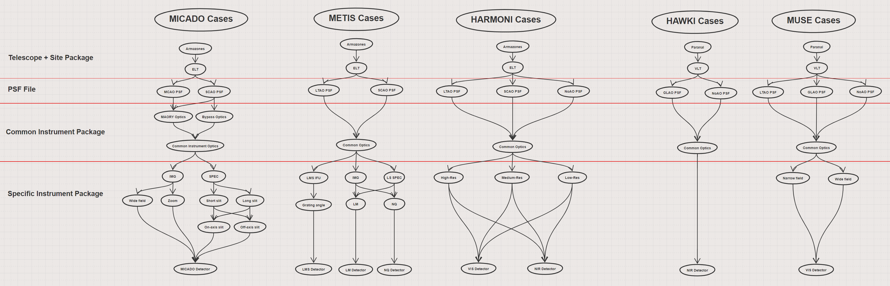
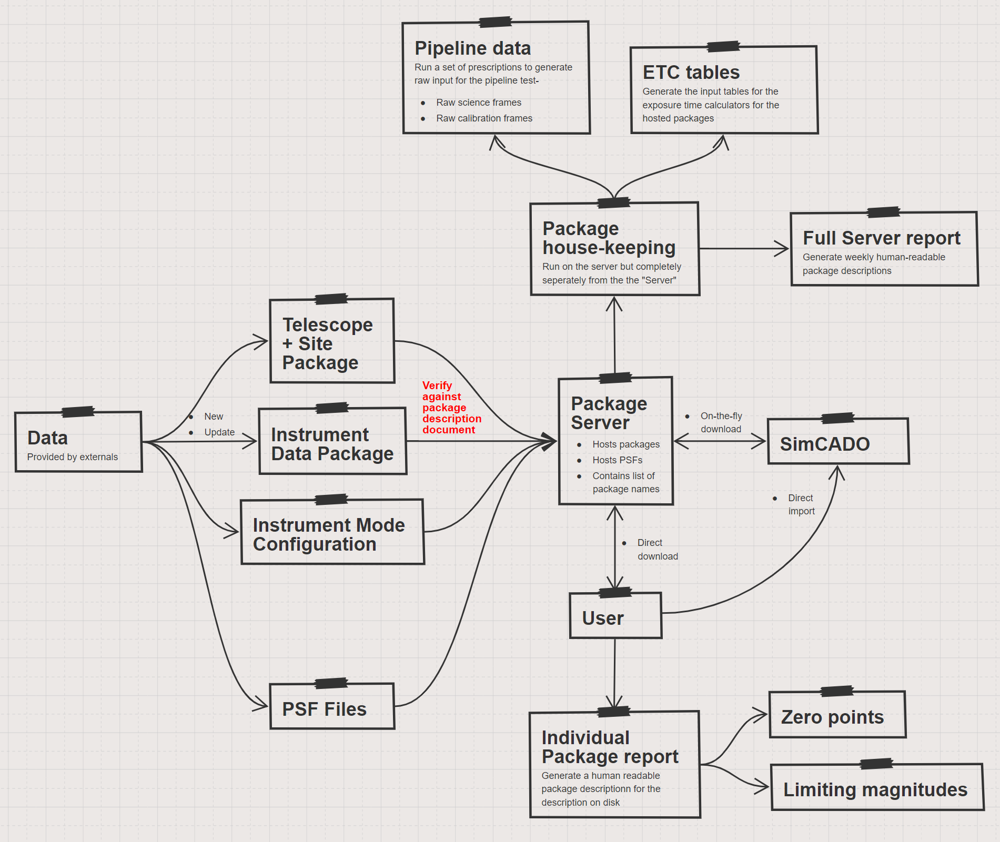

Instrument Package Database
===========================

The SimCADO software should be instrument agnostic, i.e. the code is completely
separate from the data files used to model the optical train. The primary driver
for this is the fact that the files used by simcado

This also means
that the software should theoretically be able to simulate the optical train of
any telescope-instrument configuration given the write data files.

    The major components of the optical trains for the ELT first light
    instruments, as well as the VLT LGF driven instruments HAWK-I and MUSE.

    THis is a comments

Conclusions

* The packages will be split between the instrument and telescope, but not
  between modes.
* PSF will be kept separately
* All the data for all modes for an instrument will be kept in a single
  instrument package directory
* For each of the modes there will be a config file which references the
  required files
* PSFs will be downloaded seperately from the server
* Instrument packages and telescope packages will also be downloaded separately
  as needed