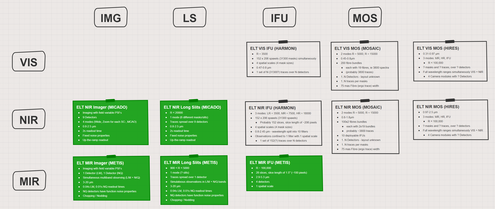

SimCADO 1.0 Scope Overview
==========================

In general there are 4 main type of instrument:

* Imager (IMG),
* Long-Slit spectrograph (LS),
* Integral-Field-Unit spectrograph (IFU), and
* Multi-Object Spectrograph (MOS)

Instruments are also generally sensitive to a specific wavelength range, although
this aspect is generally controlled by the detector technology. As such it is
not uncommon for an instrument to cover multiple wavelength ranges if the
detectors allow this. The ELT will use instrument which cover the following
three ranges:

* VIS, Visual: ~0.3 to ~0.8µm, (UBVRI)
* NIR, Near-Infrared: ~0.8 to ~2.5µm, (zYJKH)
* MIR, Mid-Infrared: ~2.5 to ~20µm, (LMNQ)

    The parameter space covered by the ELT instruments

Characteristics of Instruments at the ELT
-----------------------------------------

Imagers (IMG)
~~~~~~~~~~~~~

VIS
+++
There are no visual imagers planned for the ELT

NIR
+++
**MICADO**

* Imaging with field variable PSFs
* 9 Detectors
* 4 modes (Wide, Zoom for each SC-, MCAO)
* 0.8-2.5 µm
* 2s readout time
* Fixed noise properties
* Up-the-ramp readout

