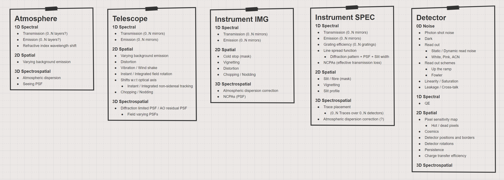

SimCADO 1.0 Scope Overview and List of Effects
==============================================

In general there are 4 main type of instrument:

* Imager (IMG),
* Long-Slit spectrograph (LS),
* Integral-Field-Unit spectrograph (IFU), and
* Multi-Object Spectrograph (MOS)

Instruments are also generally sensitive to a specific wavelength range, although
this aspect is generally controlled by the detector technology. As such it is
not uncommon for an instrument to cover multiple wavelength ranges if the
detectors allow this. The ELT will use instrument which cover the following
three ranges:

* VIS, Visual: ~0.3 to ~0.8µm, (UBVRI)
* NIR, Near-Infrared: ~0.8 to ~2.5µm, (zYJKH)
* MIR, Mid-Infrared: ~2.5 to ~20µm, (LMNQ)

.. figure:: Scope_ELT_Instrument_Overview.PNG
    :width: 600

    The parameter space covered by the ELT instruments. The instruments in green
    are those that drive the design of SimCADO. However given that these green
    cases cover 2 of the 3 wavelength regions and 3 or 4 types of instument, it
    should be reasonably easy to extent to the software to covering all 12
    categories.

Characteristics of Instruments at the ELT
-----------------------------------------

Below is a list of the instruments that operate at the ELT and some of their
defining characteristics.

Imagers (IMG)
~~~~~~~~~~~~~

Visual
++++++
There are no visual imagers planned for the ELT

Near-IR
+++++++
**MICADO**

* Imaging with field variable PSFs
* 9 Detectors
* 4 modes (Wide, Zoom for each SC-, MCAO)
* 0.8-2.5 µm
* 2s readout time
* Fixed noise properties
* Up-the-ramp readout

Mid-IR
++++++
**METIS**

* Imaging with field variable PSFs
* 1 Detector (LM), 1 Detector (NQ)
* Simultaneous multiband observing (L/M + N/Q)
* 3-20 µm
* 0.04s LM, 0.01s NQ readout times
* NQ detectors have function noise properties
* Chopping / Nodding

Long-Slit Spectrograph (LS)
~~~~~~~~~~~~~~~~~~~~~~~~~~~
Visual
++++++
There are no visual long-slit spectrographs planned for the ELT

Near-IR
+++++++
**MICADO**

* R < 20000
* 1 mode (6 different masks/slits)
* Traces spread over 9 detectors
* 0.8-2.5 µm
* 2s readout time
* Fixed noise properties
* Up-the-ramp readout

Mid-IR
++++++
**METIS**

* 900 < R < 5000
* 1 mode (? slits)
* Traces spread over 1 detector
* Simulateous observations in L/M + N/Q bands
* 3-20 µm
* 0.04s LM, 0.01s NQ readout times
* NQ detectors have function noise properties
* Chopping / Nodding

Integral-Field-Unit spectrograph (IFU)
~~~~~~~~~~~~~~~~~~~~~~~~~~~~~~~~~~~~~~
Visual
++++++
**HARMONI**

* R = 3500
* 152 x 206 spaxels (31300 masks) simultaneously
* 4 spatial scales (4 mask sizes)
* 0.47-0.8 µm
* 1 set of N (152?) traces over N detectors

Near-IR
+++++++
**HARMONI**

* 3 modes: LR = 3500, MR = 7500, HR = 18000
* 152 x 206 spaxels (31300 spaxels)
    + Probably 152 slices, slice length of ~206 pixels
* 4 spatial scales (4 mask sizes)
* 0.8-2.45 µm - wavelength split into 10 filters
* Observations confined to 1 filter with 1 spatial scale
    * 1 set of 152(?) traces over N detectors

Mid-IR
++++++
**METIS**

* R ~ 100,000
* 28 slices, slice length of 1.5" (~100 pixels)
* 2.9-5.3 µm
* 4 detectors
* 1 spatial scale

Multi-Object Spectrograph (MOS)
~~~~~~~~~~~~~~~~~~~~~~~~~~~~~~~
The MOS instruments at the ELT will be 2nd generation instruments. Hence the
details are difficult to find.

Visual
++++++
**MOSAIC**

* 2 modes R = 5000, R = 15000
* 0.45-0.8µm
* 200 fibre bundles
    + each with 19 fibres, ie 3800 spectra
    + (probably 3800 traces)
* 1..N Detectors - layout unknown
* 1..N traces per masks
* 75 mas Fibre (ergo trace) width

**HIRES**

* 0.31-0.97 µm
* 3 modes: MR, HR, IFU
    + R < 100,000
* ? masks and ? traces, over ? detectors
* Full wavelength ranges simultaneously VIS + NIR
    + 4 Camera modules with ? Detectors

Near-IR
+++++++
**MOSAIC**

* 2 modes R = 5000, R = 15000
* 0.8-1.8µm
* 100x2 fibres bundles
    + each with 2x19 bundles
    + probably ~3800 traces
* 10 deployable IFUs
* 1..N Detectors - layout unknown
* 1..N traces per masks
* 75 mas Fibre (ergo trace) width

**HIRES**

* 0.97-2.5 µm
* 3 modes: MR, HR, IFU
    + R < 100,000
* ? masks and ? traces, over ? detectors
* Full wavelength ranges simultaneously VIS + NIR
    + 4 Camera modules with ? Detectors

Mid-IR
++++++

There are no Mid-IR MOS instruments planned for the ELT (that I know of)

Several other (possibly relevant) NIR Imagers
---------------------------------------------
**VLT HAWKI**

* Imaging with field variable PSFs
* 4 Detectors
* 2 modes (No-, GLAO)
* 0.8-2.5 µm
* 1s readout time
* Fixed noise properties
* Up-the-ramp readout

**HST WFC3-IR**

* Imaging with stable no-atmo PSF
* 1 Detector
* 0.8-1.8 µm
* 1s readout time
* Fixed noise properties
* Up-the-ramp readout

**JWST NIRCam**

* Imaging with stable no-atmo PSF
* Simultaneous imaging of 2 fields of view in 2 wavelength regions
    + SW=(0.6-2.3 µm) and LW=(2.4-5 µm)
* 10 Detectors - 2x4 SW and 2x1 LW
* 2s readout time
* Fixed noise properties
* Up-the-ramp readout

List of Optical Effects
-----------------------

    Summary of the optical effects encountered in each major section of a
    astronomical optical train: atmosphere, telescope, instrument, and detector.
    The effects have been grouped according to whether they act only in the
    spectral domain, only in the spatial domain, or act over both spectral and
    spatial domains.

The effects that occur inside an optical system can be grouped according to the
domain on which they act. Here we use the convention:

* 0D - Noise and other effects which are independent of position or wavelength,
* 1D - Wavelength dependent effects,
* 2D - Position dependent effects,
* 3D - Effects which depend on position and wavelength.

These effects can be summarised as follows:

0D Noise
~~~~~~~~
Flux-independent (1 x float or 2D array)

* Dark
* Static read out
* White, Pink, ACN read out

Flux-dependent (Function)

* Photon shot noise
* Dynamic read out
* Linearity / Saturation
* Read out schemes (Up the ramp, Fowler, etc)

1D Spectral
~~~~~~~~~~~
Convolution (2 x 1D array)

* Line spread function (due to diffraction pattern + PSF + Slit width)

Shift (1 x float)

* Refractive index wavelength shift
* Redshift

Additive (2 x 1D array)

* Background emission (0..N layers?)

Multiplicative (2 x 1D array)

* Transmission (0..N layers?)
* Grating efficiency (0..N gratings)
* NCPAs (effective transmission loss)
* QE

2D Spatial
~~~~~~~~~~
Convolutions (1 x 2D array)

* Vibration / Wind shake
* Integrated rotations (e.g. field rotation over exposure time)
* Integrated shifts (e.g. non-sidereal tracking)

Shifts (N floats)

* Chopping / Nodding
* Detector rotations
* Instantaneous rotations (field rotation)
* Instantaneous shifts (non-sidereal tracking)

Additive maps (1 x 2D array)

* Cosmics
* Leakage / Cross-talk
* Persistence

Multiplicative maps (1 x 2D array)

* Varying background emission intensity
* Vignetting
* Pixel sensitivity map
* Hot / dead pixels
* Charge transfer efficiency

Masks (N floats)

* Cold stop (mask)
* Slit / fibre (mask)
* Slit profile
* Detector positions and borders

Distortions (N x 2D array)

* Optical distortions (e.g. telescope, instument misaligned optics)

3D Spectrospatial
~~~~~~~~~~~~~~~~~
Convolutions (N x 3D array)

* Static PSFs (Seeing, NCPA)
* Field varying PSFs (AO-residual)

Shifts (N x 1D array)

* Atmospheric dispersion
* Atmospheric dispersion correction
* Trace placement

List of effects per major optical component
-------------------------------------------
Each major optical component (atmopshere, telescope, instument, detector) can
be represented as a combination of several of the above-mentioned effects. Here
we list the effects which are present in each of the major optical components.

Atmosphere
~~~~~~~~~~
1D Spectral
+++++++++++

* Transmission (0..N layers?)
* Emission (0..N layers?)
* Refractive index wavelength shift

2D Spatial
++++++++++

* Varying background emission

3D Spectrospatial
+++++++++++++++++

* Atmospheric dispersion
* Seeing PSF

Telescope
~~~~~~~~~
1D Spectral
+++++++++++

* Transmission (0..N mirrors)
* Emission (0..N mirrors)

2D Spatial
++++++++++

* Varying background emission
* Distortion
* Vibration / Wind shake
* Instant / Integrated field rotation
* Shifts w.r.t optical axis
    * Instant / Integrated non-sidereal tracking
* Chopping / Nodding

3D Spectrospatial
+++++++++++++++++

* Diffraction limited PSF / AO residual PSF
    * Field varying PSFs

Instrument IMG
~~~~~~~~~~~~~~~
1D Spectral
+++++++++++

* Transmission (0..N mirrors)
* Emission (0..N mirrors)

2D Spatial
++++++++++

* Cold stop (mask)
* Vignetting
* Distortion
* Chopping / Nodding

3D Spectrospatial
+++++++++++++++++

* Atmospheric dispersion correction
* NCPAs (PSF)

Instrument SPEC
~~~~~~~~~~~~~~~
1D Spectral
+++++++++++

* Transmission (0..N mirrors)
* Emission (0..N mirrors)
* Grating efficiency (0..N gratings)
* Line spread function
    * Diffraction pattern + PSF + Slit width
* NCPAs (effective transmission loss)

2D Spatial
++++++++++

* Slit / fibre (mask)
* Vignetting
* Slit profile

3D Spectrospatial
+++++++++++++++++

* Trace placement
    * (0..N Traces over 0..N detectors)
* Atmospheric dispersion correction (?)

Detector
~~~~~~~~
0D Noise
++++++++

* Photon shot noise
* Dark
* Read out
    * Static / Dynamic read noise
    * White, Pink, ACN
* Read out schemes
    * Up the ramp
    * Fowler
* Linearity / Saturation
* Leakage / Cross-talk

1D Spectral
+++++++++++

* Quantum efficiency

2D Spatial
++++++++++

* Pixel sensitivity map
    * Hot / dead pixels
* Cosmics
* Detector positions and borders
* Detector rotations
* Persistence
* Charge transfer efficiency

3D Spectrospatial
+++++++++++++++++

Use Cases
---------
Below we list the compiled lists of optical effects for each fo the 4 instrument
types: IMG, LS, IFU, MOS. Obviously depending on the configuration of the
telescope-instrument-detector system, each effect will be present to a lesser
or greater extent in the optical systems of different observatories. In many
cases, depending on the configuration, the extent of an effect will be
negligible and thus may be ignored altogether. In general though, these lists
can be seen as a sort of cook-book for building an instrument simulator.

Imager
~~~~~~

**Atmosphere**

* 1D Atmospheric transmission
* 1D Atmospheric emission
* 2D Spatial variation in emission
* 3D Atmospheric dispersion

**Telescope**

* Loop over optical surface
    * 1D Mirror reflection
    * 1D Mirror emission
    * 2D Spatial variations in emission
* 3D System PSF (Seeing + Diffraction limited)
* 2D Vibrations (integrated [PSF])
* 2D Rotation (integrated / instantaneous)
* 2D Shifts (integrated / instantaneous)
* 2D Distortion
* 2D Chopping / Nodding

**Instrument**

* Loop over optical surfaces
    * 1D Mirror / window / filter reflection / transmission
    * 1D Mirror / window / filter emission
* 3D Atmospheric dispersion correction
* 3D NCPAs (PSF)
* 2D Vignetting
* 2D FOV Mask
* 2D Distortion
* 2D Chopping / Nodding

**Detector**

* 1D QE
* 2D Cosmics
* 2D Detector geometry (rotation, FOV)
* 2D Pixel sensitivities
* 2D Persistance
* 0D Dark noise
* 0D Leakage / Cross-talk
* 0D Linearity
* 0D Shot noise
* 0D Read noise
* 0D Read out scheme

Long-slit Spectrograph
~~~~~~~~~~~~~~~~~~~~~~

**Atmosphere**

* 1D Atmospheric transmission
* 1D Atmospheric emission
* 2D Spatial variation in emission
* 3D Atmospheric dispersion

**Telescope**

* Loop over optcial surface
    * 1D Mirror reflection
    * 1D Mirror emission
    * 2D Spatial variations in emission
* 3D System PSF (Seeing + Diffraction limited)
* 2D Vibrations (integrated [PSF])
* 2D Rotation (integrated / instantaneous)
* 2D Shifts (integrated / instantaneous)
* 2D Distortion
* 2D Chopping / Nodding

**Instrument**

* Loop over optcial surface
    * 1D Mirror / window / filter / grating reflection / transmission
    * 1D Mirror / window / filter emission
* 3D Atmospheric dispersion correction
* 3D NCPAs (PSF)
* 2D Vignetting
* 2D Slit Mask
* Loop over trace
    * 3D Spectral traces

**Detector**

* 1D QE
* 2D Cosmics
* 2D Detector geometry (rotation, FOV)
* 2D Pixel sensitivities
* 2D Persistance
* 0D Dark noise
* 0D Leakage / Cross-talk
* 0D Linearity
* 0D Shot noise
* 0D Read noise
* 0D Read out scheme

Integral Field Spectrograph
~~~~~~~~~~~~~~~~~~~~~~~~~~~

**Atmosphere**

* 1D Atmospheric transmission
* 1D Atmospheric emission
* 2D Spatial variation in emission
* 3D Atmospheric dispersion

**Telescope**

* Loop over optcial surface
    * 1D Mirror reflection
    * 1D Mirror emission
    * 2D Spatial variations in emission
* 3D System PSF (Seeing + Diffraction limited)
* 2D Vibrations (integrated [PSF])
* 2D Rotation (integrated / instantaneous)
* 2D Shifts (integrated / instantaneous)
* 2D Distortion
* 2D Chopping / Nodding

**Instrument**

* Loop over optical surfaces
    * 1D Mirror / window / filter / grating reflection / transmission
    * 1D Mirror / window / filter emission
* 3D Atmospheric dispersion correction
* 3D NCPAs (PSF)
* 2D Vignetting
* Loop over slit
    * 2D Slit Mask
    * Loop over trace
        * 3D Spectral traces

**Detector**

* 1D QE
* 2D Cosmics
* 2D Detector geometry (rotation, FOV)
* 2D Pixel sensitivities
* 2D Persistance
* 0D Dark noise
* 0D Leakage / Cross-talk
* 0D Linearity
* 0D Shot noise
* 0D Read noise
* 0D Read out scheme

Multi-object Spectrograph
~~~~~~~~~~~~~~~~~~~~~~~~~~~

**Atmosphere**

* 1D Atmospheric transmission
* 1D Atmospheric emission
* 2D Spatial variation in emission
* 3D Atmospheric dispersion

**Telescope**

* Loop over optcial surface
    * 1D Mirror reflection
    * 1D Mirror emission
    * 2D Spatial variations in emission
* 3D System PSF (Seeing + Diffraction limited)
* 2D Vibrations (integrated [PSF])
* 2D Rotation (integrated / instantaneous)
* 2D Shifts (integrated / instantaneous)
* 2D Distortion
* 2D Chopping / Nodding

**Instrument**

* Loop over optcial surface
    * 1D Mirror / window / filter / grating reflection / transmission
    * 1D Mirror / window / filter emission
* 3D Atmospheric dispersion correction
* 3D NCPAs (PSF)
* 2D Vignetting
* Loop over fibre
    * 2D Fibre Mask
    * Loop over trace
        * 3D Spectral traces

**Detector**

* 1D QE
* 2D Cosmics
* 2D Detector geometry (rotation, FOV)
* 2D Pixel sensitivities
* 2D Persistance
* 0D Dark noise
* 0D Leakage / Cross-talk
* 0D Linearity
* 0D Shot noise
* 0D Read noise
* 0D Read out scheme

Thoughts on how to hold data describing the effects in memory
-------------------------------------------------------------

Here are some of my thoughts on how best to implement a class which holds the
data needed to describe an effect.

3D Spectrospatial
~~~~~~~~~~~~~~~~~

Convolutions (N x 3D array)
+++++++++++++++++++++++++++

#.  A 2D PSF is good for holding the kernel for a single wavelength and single
    position in the FOV. For a simplified case this is sufficient for the whole
    image simulation
#.  To generalise to all wavelengths, more PSF kernels can be added for each
    wavelength.
#.  To generalise to field varying version, a series of 3D cubes are needed and
    table of FOV positions corresponding to each cube
#.  This data structure can be realisied with a mutli extension FITS file:

    * ext 0: General meta data
    * ext 1: BinTable with positional info (slice, x, y)
    * ext 2..N: 3D data-cubes with position-dependent kernels

Shifts (N x 1D array)
+++++++++++++++++++++

**Traces**

For each wavelength we need a series of positions on the focal plane through
which to draw a line

    E.g. | lam, x1, y1, x2, y2, ....|

This could be implemented using the data structure as given above:

* ext 0: General meta data
* ext 1: BinTable with catalogue of traces
* ext 2..N: BinTables with the trace positions

**Atmospheric dispersion**

#.  Atmospheric dispersion
    Here we need a table containing the following columns

        | lam, vertical_shift |

    Again using the same stucture

    * ext 0: General meta data
    * ext 1: BinTable with catalogue of shifts (possible for different airmass,
      temp, rel_hum, and pressure)
    * ext 2..N: BinTable with | lam, dx, dy | for a set of airmass, temp,
      rel_hum, and pressure values

#.  Atmospheric dispersion correction
    In the case of MICADO this is just the inverse of the previous table.
    However for METIS, there isn't a  proper ADC with rotating prisms -
    just a single exchangable static prism that corrects for a set Airmass.
    In this case the shifts are set so no interpolation should occur

#.  Alternatively this could be solved with a **function call with the relevant
    parameters from a yaml dictionary**

2D Spatial
~~~~~~~~~~
Convolutions (1 x 2D array)
+++++++++++++++++++++++++++

#.  Spatial convolutions are wavelength independent. Thus they don't need the
    3rd dimension in their data cubes. We have also not thought up any use cases
    where a purely spatial convolution would be field-varying

    Even so, the standard format could apply here

    * ext 0: general meta data
    * ext 1: catalogue of convolutions
    * ext 2..N: 2D convolution kernels

#.  Could also be generated on the fly by a function with a yaml call and the
    relevant parameters, but internally this representation would be useful

Rotations (1 float)
+++++++++++++++++++
**Instantaneous / Integrated field rotations (1 float)**

This will require a function call with the parameters:
angle / time, instant / integrated **from a yaml dictionary**

Shifts (N floats)
+++++++++++++++++
As with rotations, a function call with the parameters: dx, dy is needed

Additive maps (1 x 2D array)
++++++++++++++++++++++++++++
**Cosmics**

Will be smaller 2D images of cosmic rays, that can be placed at random around a
detector. A similar structure can be used to hold them:

* ext 0: general meta data
* ext 1: catalogue of cosmics (ext, id, dimensions, angles, length, etc)
* ext 2..N: 2D images of cosmics

**Cross-talk / Leakage**

This will probably need a function and parameters **via yaml**

**Persistance**

This would be a a series of 2D images that are the same size as the detector
chips. They would contain either a default persistance image, or an image which
is updated after each "observation". There should be an image for each detector
in the instrument, so the standard data format seems adequate:

* ext 0: general meta data
* ext 1: catalogue of persistance images
* ext 2..N: 2D images for each detetor

Multiplicative maps (1 x 2D array)
++++++++++++++++++++++++++++++++++
All the effects list here seem to be similar to the case of persistance images.
They would be full frame detector chip images, and therefore the extensions
would refer to each chip. In the case that there is a multiplicative effect
which is position-dependent and not applicable to the full array, the 2D array
describing the effect should be contained in extensions with the description in
the catalige extension (ext 1).

.. warning::

    The elefant in the room - High-Contrast Imaging - may rear its ugly head here

Masks (N floats)
++++++++++++++++
Masks are in essense the aperture used for a spectrograph. There are the
following cases:

1. Long slit - rectangular - need the coordinated of the outside edges
2. Slicer IFU - collection of long slits
3. Slit MOS - collection of long slits
4. Fibre - circular - need the centre coordinates and the radius
5. Fibre bundle IFU - collection of fibres
6. Fibre-fed MOS - collection of fibres
7. Objective prism - Basically (?) a super wide slit spectrograph

Given that there are no (?) cases of masks with weird geometries (hexagons, etc),
masks can be described in a table (possibly in ext 1).

Given that a fibre or a slit is always(?) a simple geometric shape
(circle, rectangle), a parametric description of the mask should be sufficient.
Thus the needed details for a mask are:

    id,
    central coordinates,
    width or diameter_1,
    height or diameter_2

The catalogue of masks can be kept in the ext 1 catalogue of a standard fits file.

* ext 0: meta data
* ext 1: BinTable catalogue of masks data
* ext 2: BinTable (Image?) matrix of mask-trace connections

.. note::

    Question - do we directly link the masks to the traces, or only the traces
    to the masks? If it goes in both directions, the 2nd extension could be a
    BinTable matrix connecting trace and mask

Distortions (N x 3D arrays)
+++++++++++++++++++++++++++
Two (only?) maps are needed to describe the distortions on the focal plane.
One map for each of the x- and y-components. These two maps could be combined
into a 3D data cube with dimensions (X,Y,2). This would leave open the
possibility of extending the number of layers in the 3D dimension, incase there
are some other components to the distortion that are represented by another map.
It also allow for the possibility of adding multiple detectors / camera systems
to a single optical train - see METIS with its LM and NQ simulatneous imagers.

The standards format applies:

* ext 0 - metadata
* ext 1 - catalogue of extensions
* ext 2..N - multiple-component 3D (X,Y,2) distortion maps for each detector
  focal plane

1D Spectral
~~~~~~~~~~~
Convolutions (2 x 1D array)
+++++++++++++++++++++++++++

**Line spread funtion**
This is a combination of the diffraction pattern, the PSF and the slit width.
Works out to be a single vector describing the shape of the kernel, assuming
the base uses the same bin size as whatever it's being convolved with. For the
generalised case we should include the base coordinates.

The basic data structure would be

* ext 0 - metadata
* ext 1 - catalogue of kernels
* ext 2 - BinTables with lam,val columns of the kernel(s)

Alternatively

* ext 0 - metadata
* ext 1 - BinTable with kernel

Shifts (floats)
+++++++++++++++

Shifts in the spectrum by a constant factor, i.e. a redshit
This can be done with a **yaml function call** and the relevant parameters

Additive / Multiplicative vectors (2 x 1D array)
++++++++++++++++++++++++++++++++++++++++++++++++

For this we need a spectrum with columns for:

* wavelength bin centres
* values to be added

The two formats described above in convolutions would fit this need

0D Noise
~~~~~~~~
Flux independent noise (floats or 2D arrays)
++++++++++++++++++++++++++++++++++++++++++++

**Read noise over the detector etc**

This will be different of each detector chip and so multiple extensions will be
needed for each detector chip. Hence the standard format applies

* ext 0: metadata
* ext 1: BinTable catalogue of noise maps for detector chips
* ext 2..N: Noise maps

**Single values**

These can be implemented directly on the expected flux with a yamp function or
a map derived from a value via a yaml function. The first idea sounds better

Flux dependent noise (functions)
++++++++++++++++++++++++++++++++
These are all function based and therefore best implemented with
**yaml call with kwargs**

