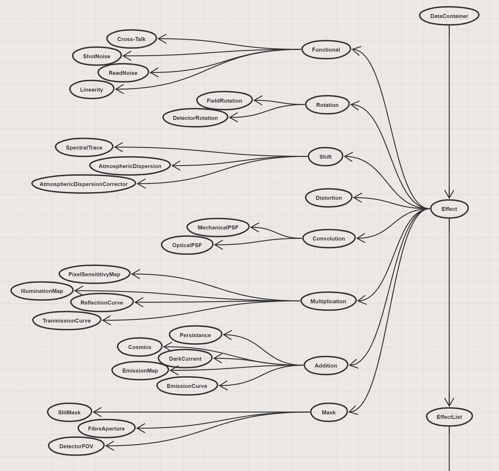
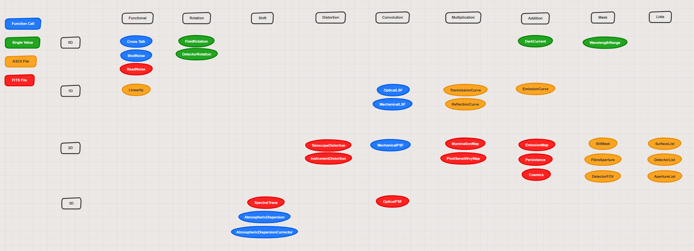

ScopeSim 1.0 Effect Descriptions
===============================
Useful for the definition of data formats which describe the optical effects of
a certain instrument + telescope configuration

List of effect dimensions
-------------------------
Effects come in either 0, 1, 2, or 3 (2+1) dimensions

* 0D: Single values which aren't associated with a dimension. These are 
  generally values needed by a function, e.g. atmospheric temperature which is 
  needed to calculate the amount of atmospheric diffraction.

* 1D: Single dimensional vectors which act in the spectral range. These are 
  generally descriptions of effects which act in the spectral domain, and 
  therefore contain columns "Wavelength" and "Values", where "Values" can 
  include: "Transmission", "Emissivity", "Emission", "Reflection".
  Input files will primarily be **ASCII files**

* 2D: Two dimensional spatial effects. There are effects which are independent 
  of wavelength and act purely in the spatial domain. The format is generally a 
  2D image of the effect. The image need not cover the full field-of-view,
  e.g. the kernel of a PSF convolution, however the image may also cover the 
  full field of a detector, e.g. the hot/dead pixel map of a detector. 
  Input files will primarily be **FITS files**

* 3D: (2D+1D) Three dimensional spectro-spatial effects. These are spatial
  effects which have a wavelength dependence. E.g. the diffraction limited PSF 
  core increases with wavelength. Input files will primarily be **FITS files**

List of effect types
--------------------

    The list of possible optical effects which occur along an optical train

* Rotation: Requires the field of view to be rotated.

  * Field Rotation during observations,
  * Detector misalignment

* Shift: Requires the field of view to be shifted as a whole, either with or 
  without a wavelength dependence

  * Spectral traces,
  * Atmospheric dispersion (correction),
  * Sky offsets,
  * Nodding and chopping

* Distortion: A spatially dependent shift over the field of view

  * Telescope / Fore optic / Instrument distortion

* Convolution: An optical aberration that causes a convolution with a kernel 
  either over the field or a spectral range

  * 1D: Spatially constant, but spectrally varying

    * Line spread function

  * 2D: Spectrally and spatially constant (Mechanical PSFs)

    * Vibrations
    * Wind shake

  * 3D: Spectrally varying, but spatially constant (Optical PSFs)

    * GLAO,
    * Approximation of MCAO
    * NCPAs

  * 5D: Spatially and spectrally varying (Optical FV-PSFs)

    * SCAO,
    * real MCAO

* Multiplication:

  * 1D: Spectral operations

    * Transmission / reflection curves
    * Grating losses

  * 2D: Spatial operations

    * Pixel sensitivity maps
    * Illumination maps (Vignetting etc)

* Addition

  * 0D: Single values

    * Dark current

  * 1D: Spectral operations

    * Emission curves

  * 2D: Spatial operations

    * Emission maps (sky, mirror emission)
    * Persistence maps
    * Artifacts (cosmics, etc)

* Mask: Masks a certain region or range

  * 0D: Single values

    * Wavelength boundaries for simulation

  * 2D: Spatial masks

    * Detector field of view
    * Fibre / Slit field of view

Others

* Functional: Effects which are generated by functions

  * Shot noise
  * Read noise
  * Cross-talk
  * Linearity / Saturation

* Lists: Combinations of a similar type of effect, or description of a certain 
  type of element

  * List of Surfaces for radiometry
  * List of Detectors and their fields of view, rotations, read / dark noise 
    levels, pixels maps
  * List of slits and fibre positions in the field of view

    A visualisation of the different optical effects according to their type and
    active dimensions

Individual data file descriptions
---------------------------------

Summary of file specific meta data
~~~~~~~~~~~~~~~~~~~~~~~~~~~~~~~~~~

Meta data which tells Telescopy how to deal with the file are kept in the
values of the following keywords (prefaced with the letter E [for Effect])::

    ETYPE : The type of effect
    EDIM  : Dimensions on which the effect acts (0 Noise, 1 Spectral, 2 Spatial, 3 Spectrspatial)
    ECAT  : Extension with catalogue information (if FITS file)
    EDATA : Extension where the data begins (if FITS file)

Possible values for these keywords are:

======== ======== ======== ======== ======== ========
ETYPE    EDIM     ECAT     EDATA    Filetype Description
-------- -------- -------- -------- -------- --------

FVPSF    5        1        2        FITS     Wavelength dependent field varying PSFs
CONSTPSF 3        1        2        FITS     Wavelength dependent field constant PSFs
SLITTRAC 3        1        2        FITS     Slit spectral trace mappings on detector plane
FIBRTRAC 3        1        2        FITS     Fibre spectral trace mappings on detector plane
DISTMAP  4        -1       1        FITS     Wavelength in/dependent distortion maps
ILLUMMAP 2        -1       1        FITS     Illumination map - spatially varying transmission
EMISMAP  2        -1       1        FITS     Emission map - spatially varying emission
PIXELMAP 2        -1       1        FITS     Pixel sensitivity maps
PERSMAP  2        -1       1        FITS     Detector chip persistence maps
COSMICS  2        1        2        FITS     Images of Cosmic ray hits
APERLIST 2        NA       NA       ASCII    Spectroscopic aperture list
CHIPLIST 2        NA       NA       ASCII    List of positions of detector chips
SURFLIST 1        NA       NA       ASCII    List of surfaces and links to TER files
TERCURVE 1        NA       NA       ASCII    Wavelength dependent spectral response curves
EMSCURVE 1        NA       NA       ASCII    Wavelength dependent emission curve (Req: EUNIT)
LINEARIT 0        NA       NA       ASCII    Linearity curve for detector response
RONFRAME 0        1        2        FITS     Read noise frames (Req: CHIPTYPE)

======== ======== ======== ======== ======== ========

3D+ Effects
~~~~~~~~~~~

2D Effects
~~~~~~~~~~

1D Effects
~~~~~~~~~~

