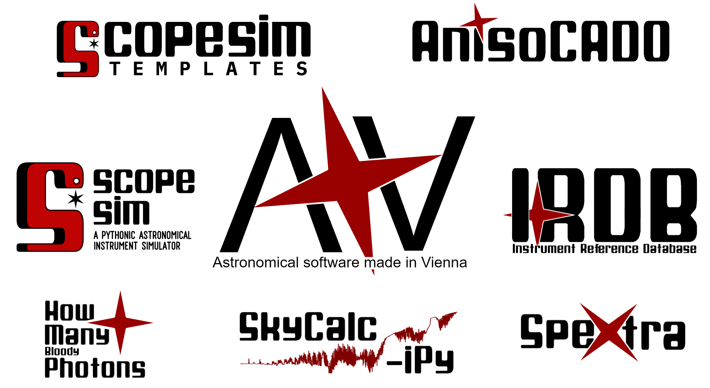

.. image:: _static/logos/banner_red_transparent.png
    :width: 600 px
    :alt: Welcome to the ScopeSim Documentation!
    :align: center

An attempt at creating a common pythonic framework for telescope instrument
data simulators.

ScopeSim_ is on pip::

    pip install scopesim

`ScopeSim templates`_ provides templates for creating on-sky sources::

    pip install scopesim_templates

.. note:: ScopeSim only supports python 3.6 and above

.. _ScopeSim:    https://scopesim.readthedocs.io/en/latest/
.. _`ScopeSim Templates`: https://scopesim-templates.readthedocs.io/en/latest/

.. toctree::
    :maxdepth: 2
    :caption: Contents:

    getting_started
    examples/index
    Reference API <reference/modules>

The ScopeSim python ecosystem
-----------------------------

There are several packages in the ScopeSim_ ecosystem to be aware of:

* ScopeSim_: The engine behind the whole simulator
* `ScopeSim Templates`_: A series of helper function to generate on-sky targets
* `SpeXtra`_: A pythonic interface to many common astronomical spectra libraries
* Pyckles_: Pythonic access to the Pickles (1998) spectral library and
  Brown (2014) spectral library
* IRDB_: The Instrument Reference Database, where the instrument packages are
  stored
* AnisoCADO_: For making SCAO PSF cubes that readable by ScopeSim
* skycalc_ipy_: Connects to ESOs SkyCalc server to get atmospheric spectra
* `How Many Photons`_: A simple package for quickly calculating the number of
  photons within a given astronomical filter

.. _ScopeSim:    https://scopesim.readthedocs.io/en/latest/
.. _`ScopeSim Templates`: https://scopesim-templates.readthedocs.io/en/latest/
.. _IRDB:        https://github.com/astronomyk/irdb
.. _AnisoCADO:   https://anisocado.readthedocs.io/en/latest/
.. _skycalc_ipy: https://skycalc-ipy.readthedocs.io/en/latest/
.. _SpeXtra:     https://spextra.readthedocs.io/en/latest/
.. _Pyckles:     https://scopesim-templates.readthedocs.io/en/latest/
.. _`How Many Photons`:  https://github.com/AstarVienna/HowManyBloodyPhotons/

.. note:: Much more information on these packages will be coming very soon!

Contact
-------
- For bugs, please add an `issue to the github repo <https://github.com/AstarVienna/ScopeSim/issues>`_
- For enquiries on implementing your own instrument package, please drop us a line at

  - `astar.astro@univie.ac.at <astar.astro@univie.ac.at>`_ or
  - `kieran.leschinski@univie.ac.at <kieran.leschinski@univie.ac.at>`_
