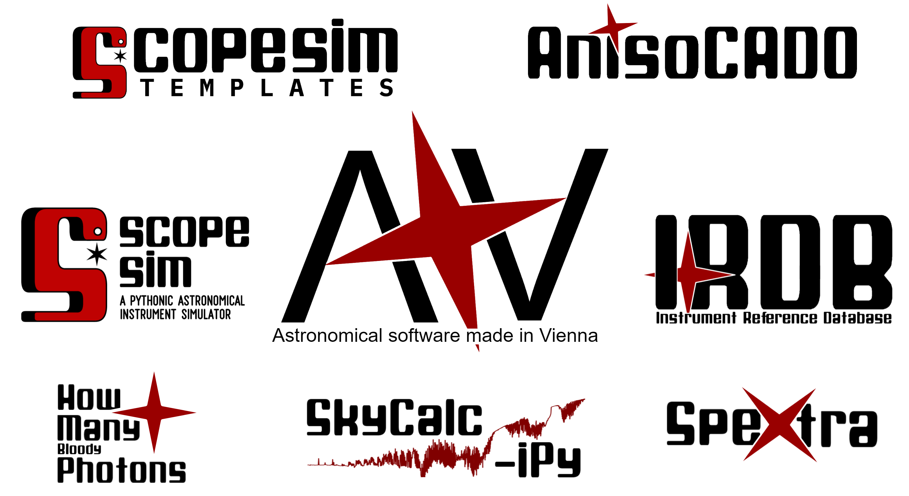

An attempt at creating a common pythonic framework for telescope instrument
data simulators.

ScopeSim_ is on pip::

    pip install scopesim

`ScopeSim templates`_ provides templates for creating on-sky sources::

    pip install scopesim_templates

.. _ScopeSim:    https://scopesim.readthedocs.io/en/latest/
.. _`ScopeSim Templates`: https://scopesim-templates.readthedocs.io/en/latest/

.. |metis_logo| image:: https://irdb.readthedocs.io/en/latest/_images/metis_scopesim_logo.png
   :height: 100px
   :target: https://irdb.readthedocs.io/en/latest/METIS/docs/README.html

.. |micado_logo| image:: https://irdb.readthedocs.io/en/latest/_images/micado_scopesim_logo.png
   :height: 100px
   :target: https://irdb.readthedocs.io/en/latest/MICADO/docs/README.html

.. |mosaic_logo| image:: https://irdb.readthedocs.io/en/latest/_images/mosaic_scopesim_logo.png
   :height: 100px
   :target: https://irdb.readthedocs.io/en/latest/MOSAIC/docs/README.html

.. |youtube_icon| image:: https://upload.wikimedia.org/wikipedia/commons/thumb/0/09/YouTube_full-color_icon_%282017%29.svg/960px-YouTube_full-color_icon_%282017%29.svg.png
   :height: 30px
   :target: https://www.youtube.com/@ScopeSimTutorials

.. note:: Looking for ELT specific user documentation?

   See the MICADO, METIS, and MOSAIC user guides on the `IRDB documentation page <https://irdb.readthedocs.io/en/latest/>`_

   |micado_logo|  |metis_logo|  |mosaic_logo|

.. note:: ScopeSim Tutorials on Youtube

   A series of introductory tutorials are now available on youtube

   |youtube_icon| @ScopeSimTutorials

.. toctree::
    :maxdepth: 2
    :caption: Contents:

    getting_started
    examples/index
    5_liners/index
    faqs/index

.. warning:: July 2022: The downloadable content server was retired and the data migrated to a new server.

   ScopeSim v0.5.1 and above have been redirected to a new server URL.

   For older verions, please either upgrade to the latest version (``pip install --upgrade scopesim``), or follow these `instructions to update the server URL <https://astarvienna.github.io/server_upgrade_instructions.html>`_ in the config file.

The ScopeSim python ecosystem
-----------------------------

There are several packages in the ScopeSim_ ecosystem to be aware of:

* ScopeSim_: The engine behind the whole simulator
* `ScopeSim Templates`_: A series of helper function to generate on-sky targets
* `SpeXtra`_: A pythonic interface to many common astronomical spectra libraries
* Pyckles_: Pythonic access to the Pickles (1998) spectral library and
  Brown (2014) spectral library
* IRDB_: The Instrument Reference Database, where the instrument packages are
  stored
* AnisoCADO_: For making SCAO PSF cubes that readable by ScopeSim
* skycalc_ipy_: Connects to ESOs SkyCalc server to get atmospheric spectra
* `How Many Photons`_: A simple package for quickly calculating the number of
  photons within a given astronomical filter

.. _ScopeSim:    https://scopesim.readthedocs.io/en/latest/
.. _`ScopeSim Templates`: https://scopesim-templates.readthedocs.io/en/latest/
.. _IRDB:        https://irdb.readthedocs.io/en/latest/
.. _AnisoCADO:   https://anisocado.readthedocs.io/en/latest/
.. _skycalc_ipy: https://skycalc-ipy.readthedocs.io/en/latest/
.. _SpeXtra:     https://spextra.readthedocs.io/en/latest/
.. _Pyckles:     https://scopesim-templates.readthedocs.io/en/latest/
.. _`How Many Photons`:  https://github.com/AstarVienna/HowManyBloodyPhotons/

.. note:: Much more information on these packages will be coming very soon!

Contact
-------
- For bugs, please add an `issue to the github repo <https://github.com/AstarVienna/ScopeSim/issues>`_
- For enquiries on implementing your own instrument package, please drop us a line at

  - `astar.astro@univie.ac.at <astar.astro@univie.ac.at>`_ or
  - `kieran.leschinski@univie.ac.at <kieran.leschinski@univie.ac.at>`_

- For friendly chat, join the slack at https://join.slack.com/t/scopesim/shared_invite/zt-143s42izo-LnyqoG7gH5j~aGn51Z~4IA

API reference
-------------

.. autosummary::
   :toctree: _autosummary
   :template: custom-module-template.rst
   :recursive:
   :caption: Package Contents

   scopesim.commands
   scopesim.detector
   scopesim.effects
   scopesim.optics
   scopesim.server
   scopesim.source
   scopesim.utils
